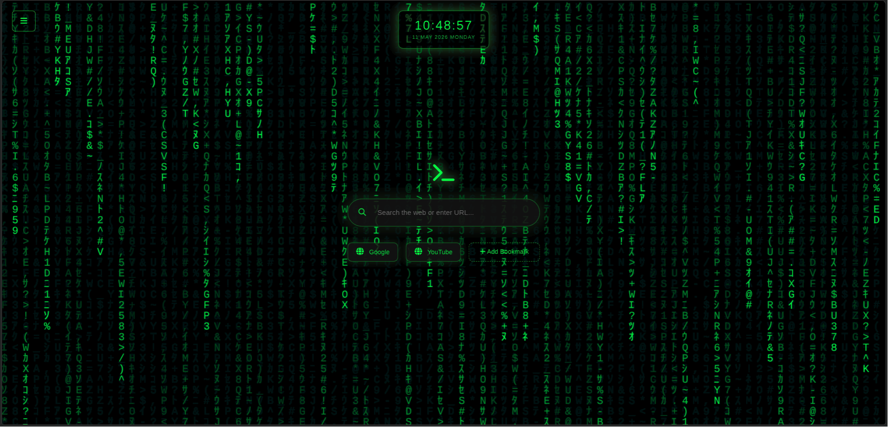
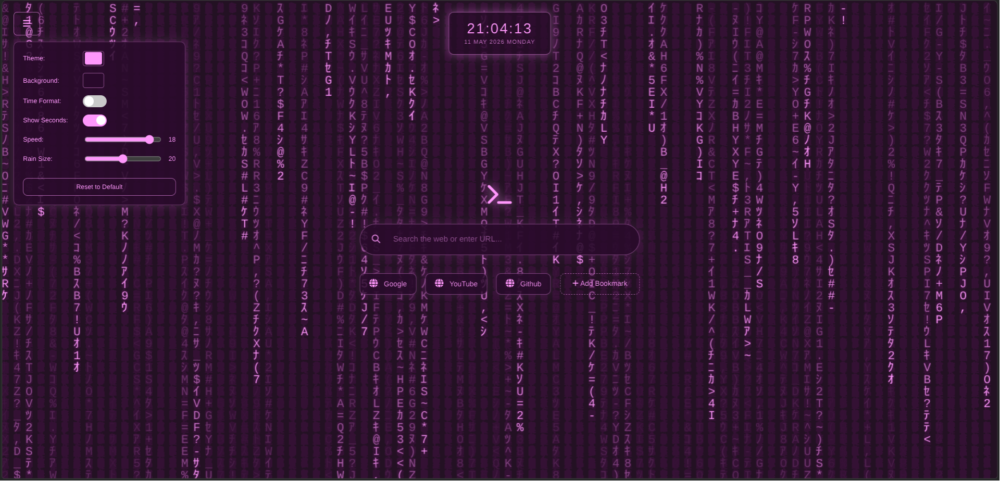
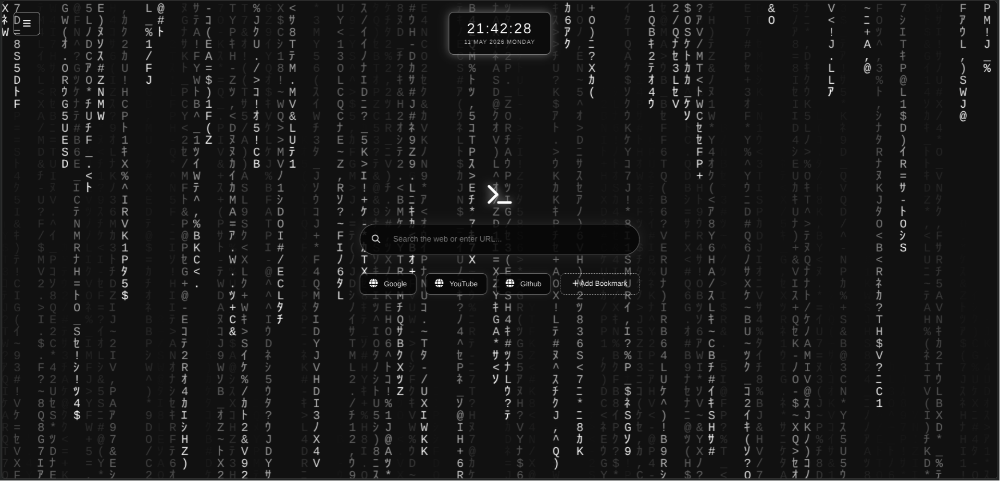
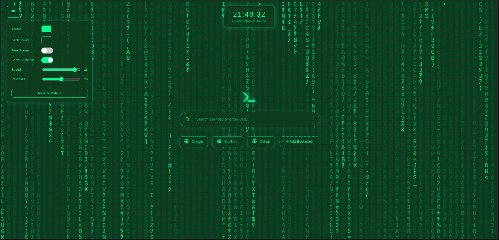
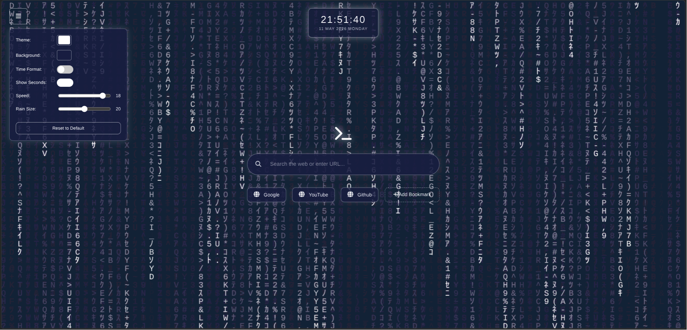

# Matrix New Tab

A sleek Matrix-inspired new tab page for Chromium browsers featuring digital rain effects, search functionality, and customizable bookmarks.

<h2>Project Preview</h2>

<div align="center">

<table>
<tr>
<td></td>
<td></td>
</tr>

<tr>
<td></td>
<td></td>
</tr>

<tr>
<td></td>
<td></td>
</tr>
</table>

</div>

## Features

* Matrix digital rain animation
* Built-in search bar
* Quick-access bookmarks
* Clean terminal-inspired UI
* Lightweight and fast

---

# Installation

## 1. Download the Extension

Visit the repository:

[Matrix_New_Tab GitHub Repository](https://github.com/fffaheem/Matrix_New_Tab)

Click **Code → Download ZIP**, then extract the ZIP file.

---

# Install on Google Chrome

1. Open Chrome
2. Go to:

```text
chrome://extensions/
```

3. Enable **Developer mode** (top-right corner)
4. Click **Load unpacked**
5. Select the extracted `Matrix_New_Tab` folder

Done — open a new tab to see the Matrix interface.

---

# Install on Microsoft Edge

1. Open Microsoft Edge
2. Go to:

```text
edge://extensions/
```

3. Enable **Developer mode** (bottom-left sidebar)
4. Click **Load unpacked**
5. Select the extracted `Matrix_New_Tab` folder

Done — open a new tab to launch the Matrix new tab page.

---

# Updating the Extension

After making changes to the files:

1. Open the Extensions page
2. Click the reload button on the extension card

Your changes will apply instantly.
