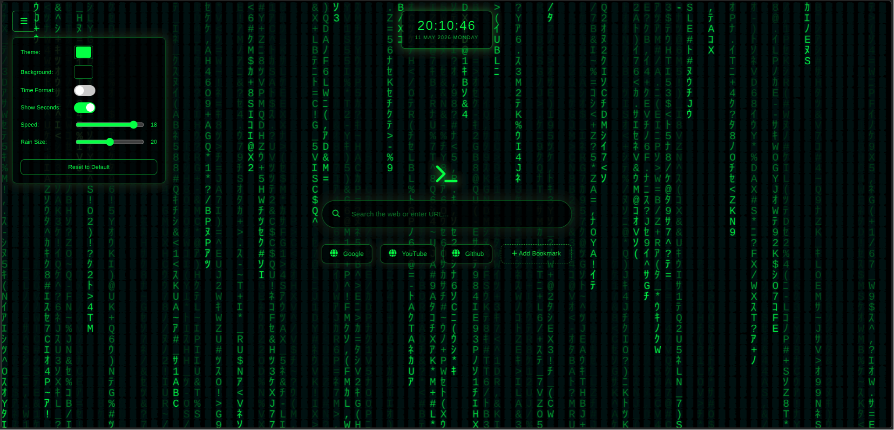
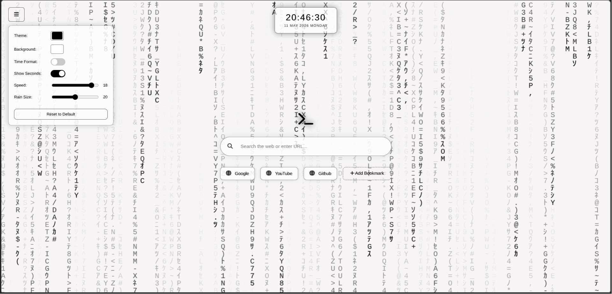
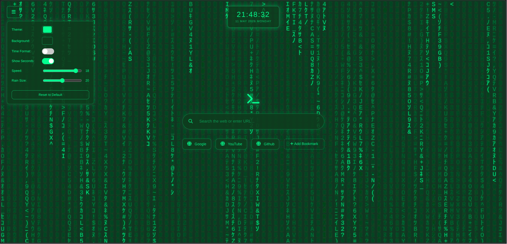
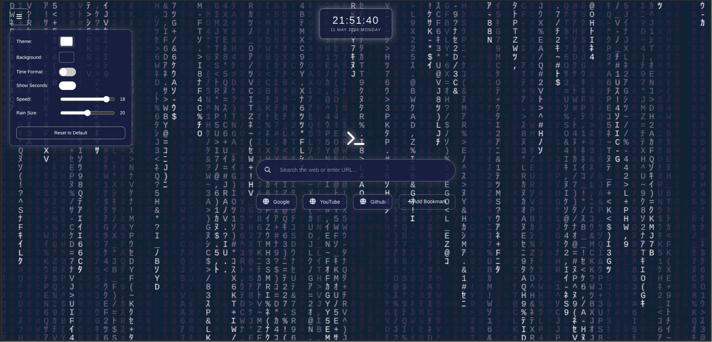

# Matrix New Tab

A sleek Matrix-inspired new tab page for Chromium-based browsers featuring digital rain effects, built-in search, and customizable bookmarks.

---

## Project Preview

<div align="center">

<table>
<tr>
<td></td>
<td></td>
</tr>

<tr>
<td></td>
<td></td>
</tr>

<tr>
<td></td>
<td></td>
</tr>
</table>

</div>

---

## Features

- Matrix-style digital rain animation
- Customizable rain speed
- Adjustable rain font size
- Changeable rain color
- Custom background color support
- Built-in search bar
- Quick-access bookmarks
- Clean terminal-inspired interface
- Multiple theme variations
- Lightweight and fast performance
- Minimal and distraction-free design

---

## Supported Browsers

- Google Chrome
- Microsoft Edge
- Brave Browser
- Other Chromium-based browsers

---

# Download

Download the latest release from the GitHub releases page:

[Download Matrix New Tab](https://github.com/fffaheem/New_Tab_Themes/releases/tag/Matrix_theme)

Extract the ZIP file.

---

# Installation

## Install on Google Chrome

1. Open Chrome
2. Navigate to:

```text
chrome://extensions/
```

3. Enable **Developer mode** (top-right corner)
4. Click **Load unpacked**
5. Select the extracted `Matrix_New_Tab` folder

Open a new tab to launch the Matrix interface.

---

## Install on Microsoft Edge

1. Open Microsoft Edge
2. Navigate to:

```text
edge://extensions/
```

3. Enable **Developer mode**
4. Click **Load unpacked**
5. Select the extracted `Matrix_New_Tab` folder

Open a new tab to launch the Matrix interface.

---

## Updating the Extension

After making changes to the extension files:

1. Open the Extensions page
2. Click the reload button on the extension card

Your changes will apply instantly.

---

## Custom Bookmarks

You can manually edit the default bookmarks inside:

```js
script.js
```

Locate the `custom_default` variable to modify bookmark entries.


Example:

```js
let custom_default =
[
    { id: '1', name: 'Google', url: 'https://google.com' },
    { id: '2', name: 'YouTube', url: 'https://youtube.com' }
];
```

---


<div>

Made by Mohd Faheem Ahmad

</div>
