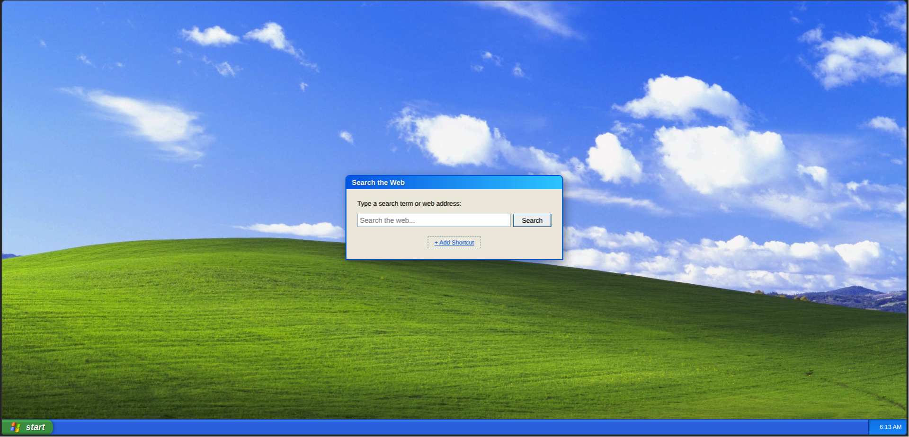
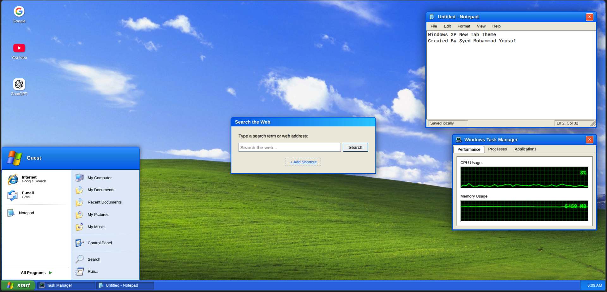

# Windows XP New Tab

A nostalgic Windows XP-inspired new tab page for Chromium-based browsers featuring the classic Luna desktop style, Start menu, built-in search, shortcuts, and a locally saved Notepad app.

---

## Project Preview

<div align="center">





</div>

---

## Features

- Windows XP-inspired desktop interface
- Classic XP taskbar and Start menu
- Built-in web search
- Custom quick-access shortcuts
- Add and remove shortcut support
- Windows XP-style Notepad app
- Notepad text saved locally in the browser
- Windows XP-style Run dialog
- Task Manager-style performance window
- Local wallpaper and icon assets
- Lightweight and fast performance
- Minimal new tab replacement for daily browsing

---

## Supported Browsers

- Google Chrome
- Microsoft Edge
- Brave Browser
- Other Chromium-based browsers

---

# Download

Download the latest release from the GitHub releases page:

[Download Windows XP New Tab](https://github.com/fffaheem/New_Tab_Themes/releases)

Extract the ZIP file.

---

# Installation

## Install on Google Chrome

1. Open Chrome
2. Navigate to:

```text
chrome://extensions/
```

3. Enable **Developer mode** (top-right corner)
4. Click **Load unpacked**
5. Select the extracted `xp_theme` folder

Open a new tab to launch the Windows XP interface.

---

## Install on Microsoft Edge

1. Open Microsoft Edge
2. Navigate to:

```text
edge://extensions/
```

3. Enable **Developer mode**
4. Click **Load unpacked**
5. Select the extracted `xp_theme` folder

Open a new tab to launch the Windows XP interface.

---

## Updating the Extension

After making changes to the extension files:

1. Open the Extensions page
2. Click the reload button on the extension card

Your changes will apply instantly.

---

## Custom Shortcuts

Use the **Add Shortcut** button on the new tab page to create your own quick-access links.

---

## Notepad Storage

The built-in Notepad saves your text locally in the browser.

Your note is stored under:

```text
xp-notepad-document
```

---

<div>

Developed by Syed Mohammad Yousuf

</div>
